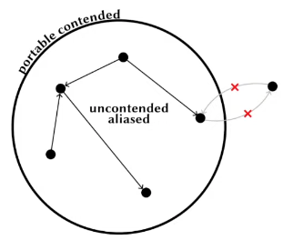

Be in mind that **it's not an article**, just scattered notes about this interesting topic, maybe for a future article

# Modes

A mode is attached to a variable upon declaration, either in a let binding or in a function parameter. It's also ortogonal to types, types describe data structures, modes can be used to enforce certain constraints, optimize performance, or ensure safety in programming languages. The mode of `l ` is separated from the type of `x`.

- Modes are deep, local contains locals and globals contain globals

```ml
let local x = 0
(* val x : int @ local *)
```

## @ locality

- **global:** permanent lifetime (GC, located on the Heap)
- **local:** lifetime restricted to current region (located on the Stack)

If a function argument is **local** it can't scape the scope of the function, which means that its lifetime is restricted to the body of the function so the function can't return it or save it in a global reference.

```ml
let sm @ global : t ref = ref (...)
let f : t @ local -> unit = fun x -> sm := x
           Error: value escapes its region ^
```

```ml
let bar () =
    let list = local_list () in
    list
    ^^^
    Error: this value escapes its region
```

In the previous example, we are trying to save a **local** binding as a **global** reference and throws an Error.

```ml
let sm @ global : (unit -> t) ref = ref ...
let f : t @ local -> unit = fun x -> sm := (fun () -> x)
           Error: value escapes its region ^
```

This time we are trying to save a closure that contains a **local** bindig as a global reference and also throws an Error.

### Sub-moding

**global** is a submode of **local** because... // TODO: finish // and because of that allow global values to be used at the **local** mode.

```ml
let global y = 1
let some_fun (local x) =
    ...

some_fun y
(* this is possible *)
```

## @ uniqueness

- **unique:** has never been copied, a value is unique if exist exactly one reference to it, ensuring that the value is not shared with any other part of the program.
- **aliased:** copies may exist, a value has more than one reference to it.

```ml
let x @ unique : key = ... in delete x; delete x
          Error: x cannot be treated as unique ^
```

```ml
let foo (unique x) =
    consume x;
    x
    ^ Error: x is used uniquely so cannot be used twice.
```

**Explanation:** The first delete x operation acts on x, making it aliased or invalid for further unique operations. The second delete x fails because x is no longer unique, leading to the error.

### Transition to Aliased Mode

If a unique value is shared (i.e., another reference to it is created), it transitions to aliased mode.

It prevents operations that could lead to undefined behavior or data races by _disallowing multiple unique operations on the same reference_. If a data structure is unique, the compiler can perform **in-place updates** and destructive operations without worrying about affecting other parts of the program.

The concept of **in-place updates** avoid the overhead of allocating new memory for modified data. Instead of creating a copy of the data structure and modifying the copy, the original data structure is directly altered, which is a characteristic of mutable data, in other words, it allow to handle mutable data in a safety way.

### Sub-moding

A unique value can be used as an aliased value, so unique is a sub-mode of aliased.

```ml
let bar (unique x) =
    x, x
(* val bar : 'a @ unique -> 'a * 'a *)
```

This is valid code, in fact the unique value `x` is converted to aliased at the right side of the arrow there is no uniqueness constrain.

- a unique parameter means the _caller_ promises to provide uniquely reference values. The _callee_ is hence allowed to overwrite the value.
- a aliased parameter doesn't assume anything, by default a parameter is aliased.

## @ affinity

It's the dual of uniqueness

- **many:** can be used (copied) multiple times
- **once:** carries the restriction of been used at most once, it cannot be copied, ensures unique ownership of resources

```ml
let x @ once : 1 in x + x
    Error: x cannot be copied
```

## @ uniqueness and @ affinity

uniqueness and affinity are the two faces of a linear system

- closures that capture **unique** values are **once**, in other words, can't be applied more than once
- **many** closures can only capture values as **aliased**

```ml
(* Suppose delete : key @ unique -> unit *)
let x @ unique : key = ... in
let f = (fun () -> delete x) in List.iter f l
   Error: f cannot be used multiple times ^
```

Here `List.iter` invoke the closure `f` more than once and it's not allowed.

### Sub-moding

many is a sub-mode of once

- A once parameter means the callee promises not tu use the value more than once.
- A many parametr encodes no premise; the callee may use the value any number of times.

```ml
let baz (once x) =
    x, x
       ^ Error: fond a once value where a many walue was expected.
```

## @ contention

- **uncontended:** can read and write mutable fields
- **shared:** can read but not write mutable fields
- **contended:** cannot access mutable fields

A llow the compiler to know if some value is allowed to modify the content of a reference.

```ml
let f : int ref @ contended -> unit = fun x -> x := 42
                    Error: potential data race ^
```

## @ partability

It's the dual of contention, it allow or disallow to share values accross threads

- **portable:** can be transmitted to other threads
- **nonportable:** cannot

```ml
let f @ nonportable = ... in
Thread.create f ()
              ^ Error: cannot cross threads
```

## @ contention and @ portability

Together, contention and portability, avoid mutations from other threads in the current thread.

- closures that capture **uncontended** or **shared** binding should be **nonportable**
- **portable** closures can only capture **contended** bindings,

```ml
let x @ uncontended : int ref = ref 42 in
let f @ nonportable : unit -> int = fun _ -> !x in
Thread.create f ()
              ^ Error: can't cross threads
```


# The task

As @ contention and @ portability are very restrictive it's necessary to build a **Capsule API** that allow thread communication in a controled way by using @ locality, @ affinity and @ uniqueness.

What do we have:

- Contention ---> sharing xor mutability
- Portability

- Locality ---> capsule API
- Affinity
- Uniqueness

## Capsule API



Capsule ensures that only a thread at a time can access to the content with **Write** permissions and also allow multiple threads to \*\* \*\* the content at the same time, this is done by tracking ownership of the content of the Capsule.

- **portable** containers that encapsulate uncontended, possibly **aliased** data
- access requires holding a key
- uses keys/tokens to allow the content access:
  - **unique** key -> R/W access
  - **aliased** key -> read only access

```ml
module Key : sig
    type 'k t default portable contended
    type packed = Key : 'k t -> packed
    val create : unit -> packed @ unique
end
```

Encapsulating Data

```ml
module Data : sig
    type ('a, 'k) t default portable contended
    val create :
        (unit @ . -> 'a @ .) @ local once portable -> ('a, 'k) t @ .
```
